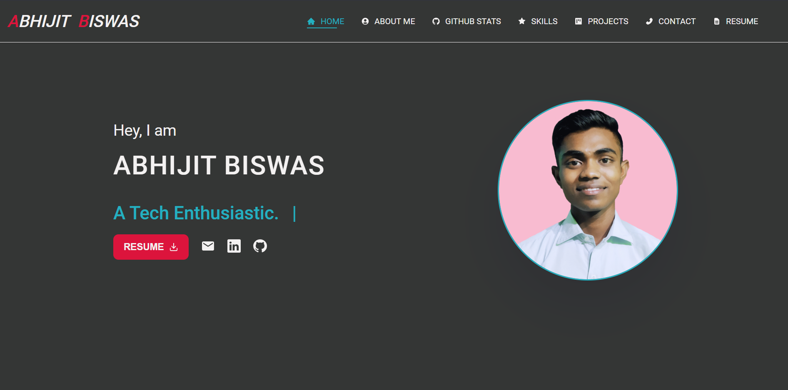
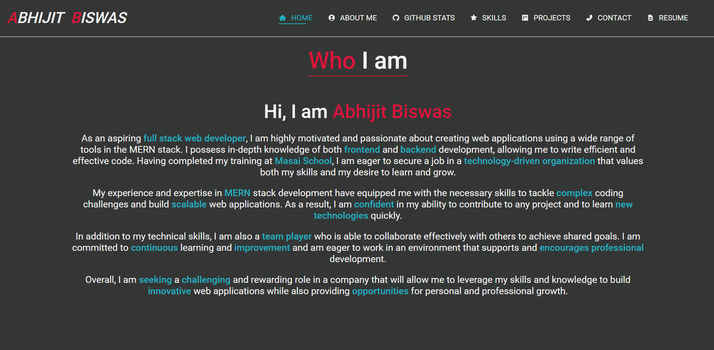
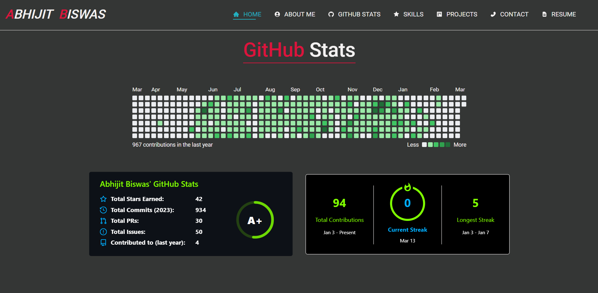
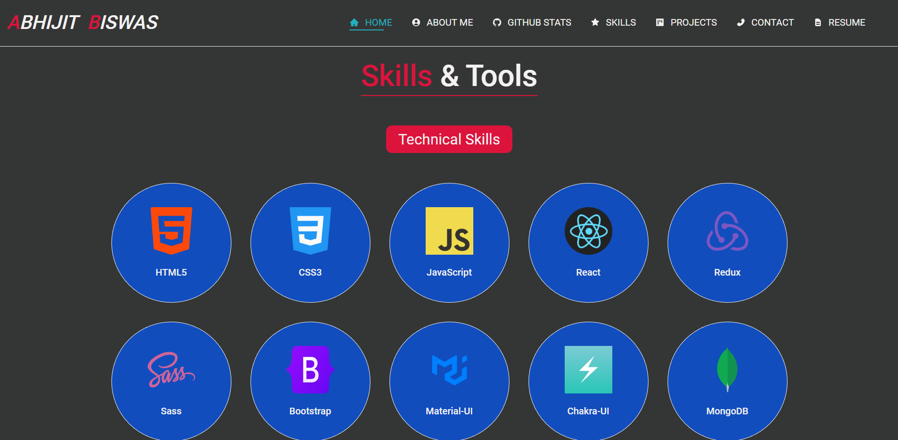
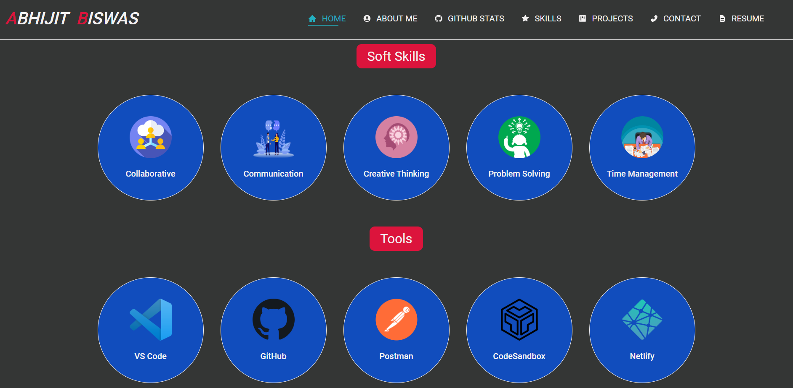
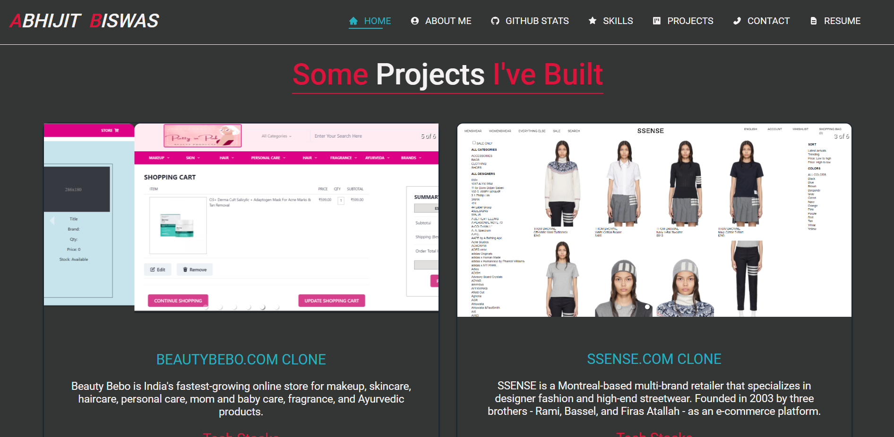
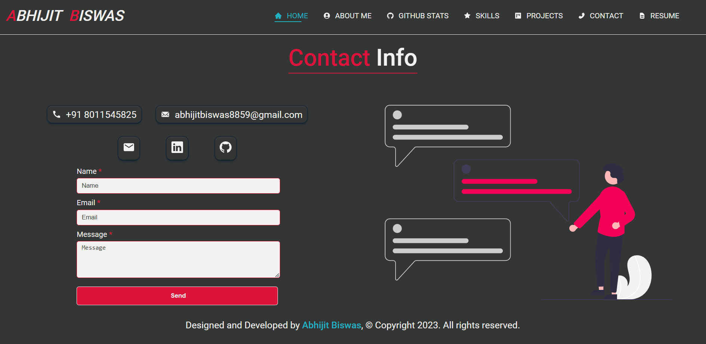

<h1 align="center">ABHIJIT BISWAS's PORTFOLIO</h1>

<h2 align="center">This is about my React portfolio which utilizes CSS3 (Sass) for styling. All the components are separated and follow the DRY principle as much as possible. I plan on adding more components while keeping things simple.</h2>

 
 

## Live portfolio link

https://abhijitnr.github.io/

## 🚀 Things that I added to my portfolio

- I added a responsive navbar that adapts to different screen sizes.
- I added a resume button to the home section, allowing users to download my resume, and also included a link to my social media.
- I added information about myself in the about section.
- In the "GitHub Stats" section, I added my GitHub contribution calendar, streak, and other relevant statistics.
- In the skills section, I have listed my technical skills along with the soft skills I possess, as well as the tools I have used to develop websites.
- In the "Projects" section, I have added four projects that I built both individually and with a team.
- In the "Contact" section, I have included my phone number and email address. Additionally, you can also reach out to me directly through the provided social media links or by using the contact form.
- My portfolio is designed to be responsive on all screen sizes.
- In my portfolio I also used animation using `framer-motion`.

## Tech stacks and libraries

- HTML5
- CSS3
- Sass
- JavaScript
- React
- react-github-calendar
- react-icons
- react-responsive-carousel
- typewriter-effect
- @emailjs/browser
- @emotion/react
- @emotion/styled
- @mui/icons-material
- @mui/material
- framer-motion
- react-spinners

## Overview of my portfolio

### Home

### About

### GitHub Stats

### Technical skills, soft skills and tools

### Projects

### Contact

<h2 align="center">Thank you for visiting my portfolio. 😊😊</h2>
